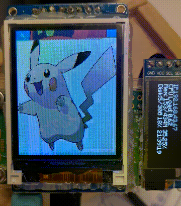
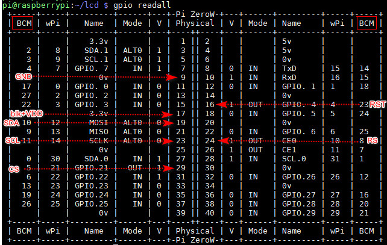
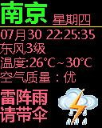
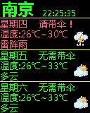
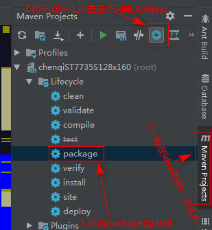
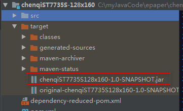

# 结果展示
1. 显示效果：
    

# 接线说明
1. 以树莓派的BCM引脚模式进行接线，好处是java定义树莓派引脚的时候，直接使用BCM引脚号即可。
2. 可以使用指令 **gpio readall**   查看引脚，最靠左右两边的即是BCM模式的引脚读数
    
3. 我买的这个屏幕是1.8寸的128x160的屏幕，共8个引脚，与树莓派的连接见上图，以及下方说明
    GND->接地
    blk(屏幕背景灯，这个引脚单独搞出来，可能是给我们控制亮度用的，比如pwm)+VDD -> ST7735S直接接入3.3v是可以的
    SDA -> SPI数据，接MOSI（BCM10）
    SCL -> SPI时钟，接SCLK（BCM11引脚）
    CS -> 千万不能接地，因为后续传指令，传数据，都需要CS低电平变高电平来结束一个读数周期。（BCM5）
    RET -> 复位，低电平转高电平进行复位（BCM23）
    RS -> 指令控制口（BCM8）
4. 实际上，买1.3寸的屏幕，有240x240的分辨率，还更便宜。不过1.8寸屏幕既买之，则驱动之。
# 代码参考说明
1. 代码，主要是参考**shengDay**的《[树莓派GPIO入门11-驱动液晶屏幕（一）](https://blog.csdn.net/shenghuaDay/article/details/78242993)》，这个博主也是用的ST7735S，借鉴意义非常大，讲解的也非常好。
    1. 但是也有一个诡异的地方，为啥我的这个ST7735S的16Bit的色彩，传数据的排序是Blue-Green-Red，而不是Red-Green-Blue呢？如果谁知道的请不吝赐教。
    2. 原来我以为是我java代码写反了，使用作者的代码跑。也是一样的结果，真实的数据排序是Blue-Green-Red
2. 这篇**DevinTT**的内容《[树莓派使用上spi tft！（fbtft的使用）](https://blog.csdn.net/DevinTT/article/details/72814539)》，也可以作为参考，但是ST7735S和ST7735R的驱动，应该是有些不同的，我最初就是按这篇内容的搞法，搞半天不灵。
3. 我的java驱动代码已经提交，关键看这个路径下的代码：com.chenqi.tft.st7735s。[github代码地址在这](https://github.com/chenqide163/waveShare4in2/tree/master/src/main/java/com/chenqi/tft/st7735s)
4. 关键java代码见下，入参要求为128x160的RGB的bufferedImage：
    ```java
     /**
     * 画图（16bit的色彩）
     *
     * @param bufferedImage
     * @throws IOException
     */
    public void drawImg16BitColor(BufferedImage bufferedImage) throws IOException {
        System.out.println("start to write Lcd Img");
        init();
        for (int y = 0; y < HEIGHT; y++) {
            for (int x = 0; x < WIDTH; x++) {
                int rgb = bufferedImage.getRGB(x, y);
                int red = (rgb >> 16) & 0xff; //获取红色的色值
                int green = (rgb >> 8) & 0xff;
                int blue = rgb & 0xff;
                red = red * 0x1f / 0xff; //st7735s的红色占5位，即0x1f
                green = green * 0x3f / 0xff; //st7735s的绿色占6位，即0x3f
                blue = blue * 0x1f / 0xff; //st7735s的蓝色占5位，即0x1f

                int highBit = 0x00;
                int lowBit = 0x00;
                highBit = highBit | (blue << 3) | (green >> 3);
                lowBit = lowBit | (green << 5) | red ;
                writeEveryPixel16Bit(highBit, lowBit);
            }
        }
    }
    ```

# 结果展示
1. 第一屏展示当天天气，第二屏展示今天、明天、后天一共三天的天气。
    
# 参考资料
1. 感谢sojson这个网站的站长，应该是站长吧，无私地开放免费获取天气预报的接口，接口数据满足个人玩乐使用。该免费接口的说明见[这里](https://www.sojson.com/api/weather.html)
2. 驱动这个128x160的lcd屏幕，见我之前的一篇内容：《[树莓派 java 驱动 lcd tft spi 1.8寸 ST7735S](https://blog.csdn.net/chenqide163/article/details/107549098)》，我代码重新精简了一下，相信有初级java开发经验的同学都能看懂。代码的github地址见[这里]()---待填入
# 代码简单说明
1. 如果下雨的天，则使用红色进行展示信息，主要就是用来提示是不是应该带伞，毕竟南京还真是常常下雨，我骑自行车上班很遭罪。。
2. 如果不下雨的天（晴、多云、阴），则使用绿色展示信息
3. 获取天气的json了之后，存在文件中，如果从文件中读到了天气信息，直接用于展示，而不是再去调用网络接口
4. 每小时调用网络接口获取一次信息
5. tips：先生成128x160的图片，在本地电脑上使用main函数跑出来，看效果了之后，再传入到lcd屏幕中进行展示，关键代码以及生成的图片见下：
    ```java
    public static void main(String[] args) throws IOException {
        //生成今天的天气预报图片
        BufferedImage bufferedImage = getSojsonFutureWeatherImg();
        ImageIO.write(bufferedImage, "jpg", new File("D:\\weatherFuture.jpg"));
        //生成今天、明天、后天的天气预报图片
        bufferedImage = getSojsonWeatherImg();
        ImageIO.write(bufferedImage, "jpg", new File("D:\\weatherToday.jpg"));
    }
    ```
    第一屏今天的天气详情：
    
    第二屏，今天、明天、后天的天气概要
    
6. 代码文件中包含了各个天气的图标，在src\main\resources\weatherIcon目录中
7. 生成第一屏的关键代码参考：[getSojsonWeatherImg()方法](https://github.com/chenqide163/chenqiST7735S-128x160/blob/master/src/main/java/com/chenqi/tft/st7735s/GetSojsonWeatherImg.java)
7. 生成第二屏的关键代码参考：[getSojsonFutureWeatherImg()方法](https://github.com/chenqide163/chenqiST7735S-128x160/blob/master/src/main/java/com/chenqi/tft/st7735s/GetSojsonWeatherImg.java)
8. lcd tft spi 1.8寸 ST7735S 的java驱动参考：[]()
9. ideal中生成jar包，不要install生成，使用package生成，双击package即可。见下图讲解
    
10. 将出的包：chenqiST7735S128x160-1.0-SNAPSHOT.jar（别取错包了），拖入到树莓派的任意目录。为啥出的是这个包，请参考pom.xml文件，我们使用了插件，指定com.chenqi.tft.st7735s.ST7735SMain为mainClass来出这个jar包，所以这个jar包是一个可运行的jar包，执行效果等同于执行main函数。
    
11. 树莓派上的执行指令为：java -jar chenqiST7735S128x160-1.0-SNAPSHOT.jar